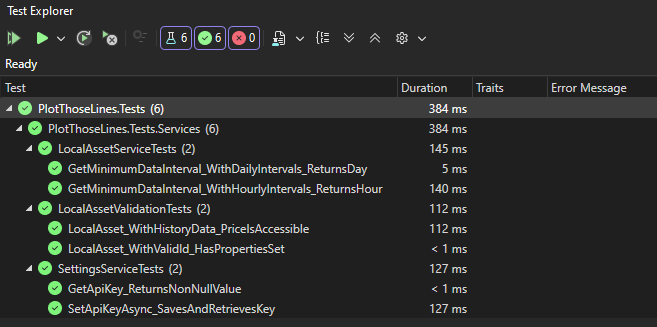

# 📝 Rapport – P_FUN-323-PlotThoseLines - Eliott Scherrer MID3A<!-- omit from toc -->

# 📋 Table des matières<!-- omit from toc -->
- [🧭 1. Introduction](#-1-introduction)
- [🗺️ 2. Planification](#️-2-planification)
  - [📆 2.1 Organisation générale](#-21-organisation-générale)
  - [🏃‍♂️ 2.2 Détail des sprints](#️-22-détail-des-sprints)
    - [Sprint 1 - Planification du projet](#sprint-1---planification-du-projet)
    - [Sprint 2 - Analyse des besoins](#sprint-2---analyse-des-besoins)
    - [Sprint 3 - Conception et design](#sprint-3---conception-et-design)
    - [Sprint 4 - Ingestion des données via API](#sprint-4---ingestion-des-données-via-api)
    - [Sprint 5 - Importation de données locales](#sprint-5---importation-de-données-locales)
    - [Sprint 6 - Fonctionnalités avancées de visualisation](#sprint-6---fonctionnalités-avancées-de-visualisation)
    - [Sprint 7 - Visualisation et interactions](#sprint-7---visualisation-et-interactions)
    - [Sprint 8 - Amélioration UX et finalisation](#sprint-8---amélioration-ux-et-finalisation)
  - [⚖️ 2.3 Critères de priorité](#️-23-critères-de-priorité)
- [🧪 3. Rapport de tests](#-3-rapport-de-tests)
  - [✅ 3.2 Tests d’acceptance](#-32-tests-dacceptance)
  - [⚙️ 3.3 Rapport de test généré par Visual Studio pour les tests unitaires](#️-33-rapport-de-test-généré-par-visual-studio-pour-les-tests-unitaires)
- [📰 4. Journal de travail](#-4-journal-de-travail)
- [🤖 5. Usage de l’IA](#-5-usage-de-lia)
- [✅ 6. Conclusion / Bilan](#-6-conclusion--bilan)

# 🧭 1. Introduction
L'objectif produit de ce projet est d'afficher plusieurs séries temporelles avec une UI flexible (zoom, intervalles, tooltips), le programme doit également comporter un système d'import de données JSON local et via API.  

Pour les objectifs pédagogiques, il s'agit de pratiquer l'utilisation de la librairie LinQ en supprimant donc les boucles for etc (qu'on apprend en parallèle pendant le module 323), écriture de 2 extensions C# ou plus, création de tests unitaires pour le projet, utilisation d'un framework pour l'interface utilisateur au choix (forms, maui, uno, wpf, fna, ...), intégration d’une librairie de graphiques pour présenter les données au choix (ScottPlot recommandée).

J'ai donc réfléchi à un projet dans le domaine des crypto-monnaies, permettant d'afficher l'évolution de plusieurs crypto-monnaies (Bitcoin, Ethereum, etc.) sur des périodes choisies : 1 jour, 7 jours, 1 mois, 1 an et All.  
L'utilisateur pourra importer des données via une API publique. J'ai choisi TokenInsight, qui propose des données historiques gratuitement, mais qui ne fournit pas de données du type OHLCV (Open, High, Low, Close, Volume). Je vais donc devoir générer ces données de façon fictive dans le cadre de ce projet mais dans la réalité on trouverait des API fournissant ce type de données.  
L'utilisateur pourra aussi importer des fichiers JSON locaux contenant des données similaires.  
L'interface utilisateur est conçue pour être intuitive et flexible, permettant aux utilisateurs d'effectuer un zoom sur des périodes spécifiques et de visualiser les données sous forme de graphiques interactifs. J'ai choisi la libraire ApexCharts pour la visualisation des données, qui a une version C# en Blazor MAUI.

# 🗺️ 2. Planification

## 📆 2.1 Organisation générale

Le projet a été découpé en 8 sprints répartis sur les 32 périodes disponibles, suivant une mthodologie SCRUM/agile. Chaque sprint a une durée de 4 périodes le mercredi de chaque semaine.

## 🏃‍♂️ 2.2 Détail des sprints

### Sprint 1 - Planification du projet
- **Durée estimée** : 3 périodes
- **Priorité** : P0 (Critique)
- **Issues** :
  - [Task] Planification - Taille S
- **Objectifs** :
  - Définir l'architecture globale du projet
  - Choisir les priorités de développement
  - Créer la structure du projet sur GitHub
  - Configurer l'environnement de développement

### Sprint 2 - Analyse des besoins
- **Durée estimée** : 3-4 périodes
- **Priorité** : P0 (Critique)
- **Issues** :
  - [Task] Rédaction des User Stories - Taille M
- **Objectifs** :
  - Rédiger les User Stories avec tests d'acceptance
  - Définir le domaine d'application choisi (crypto-monnaies)
  - Identifier les sources de données API
  - Valider les US avec le client

### Sprint 3 - Conception et design
- **Durée estimée** : 4 périodes
- **Priorité** : P0-P1
- **Issues** :
  - [Task] Maquettes Figma - Taille L
  - Lister les marchés crypto - Taille M
- **Objectifs** :
  - Créer les maquettes de toutes les interfaces
  - Penser à l'expérience utilisateur
  - Valider le design avec le client

### Sprint 4 - Ingestion des données via API
- **Durée estimée** : 4 périodes
- **Priorité** : P0 (Critique)
- **Issues** :
  - [EPIC] Ingestion des données et API - Taille XL
  - Récupération des données historiques- Taille L
  - Importation des données API - Taille M
- **Objectifs** :
  - Implémenter la connexion à l'API de crypto-monnaies
  - Récupérer les données historiques (OHLCV)
  - Mettre en place la structure de données avec LINQ
  - Créer les premières extensions C#

### Sprint 5 - Importation de données locales
- **Durée estimée** : 3-4 périodes
- **Priorité** : P0-P1
- **Issues** :
  - [EPIC] Importation des données - Taille XL
  - Importation de données JSON local - Taille M
  - Sélectionner des intervalles - Taille M
- **Objectifs** :
  - Supporter l'importation de fichiers JSON locaux
  - Implémenter la sélection d'intervalles temporels
  - Utiliser LINQ pour le traitement des données
  - Tests unitaires sur l'importation

### Sprint 6 - Fonctionnalités avancées de visualisation
- **Durée estimée** : 3 périodes
- **Priorité** : P1
- **Issues** :
  - Superposer des périodes différentes - Taille M
- **Objectifs** :
  - Permettre l'affichage de périodes non-consécutives
  - Optimiser les performances d'affichage
  - Implémenter la gestion multi-sources

### Sprint 7 - Visualisation et interactions
- **Durée estimée** : 4 périodes
- **Priorité** : P0-P2
- **Issues** :
  - [EPIC] Visualisation & Interaction - Taille XL
  - Affichage multi-séries temporelles - Taille L
- **Objectifs** :
  - Intégrer la librairie graphique (ApexCharts)
  - Afficher plusieurs séries temporelles simultanément
  - Ajouter les extensions C# manquantes si besoin

### Sprint 8 - Amélioration UX et finalisation
- **Durée estimée** : 3 périodes
- **Priorité** : P2
- **Issues** :
  - Clarté de la page d'Assets - Taille S
  - Expérience utilisateur lors de l'importation d'assets - Taille M
  - Page Settings - Taille S
- **Objectifs** :
  - Améliorer l'ergonomie de l'interface
  - Créer la page de paramètres
  - Tests finaux et corrections de bugs
  - Préparation de la release

## ⚖️ 2.3 Critères de priorité

- **P0 (Critique)** : Fonctionnalités essentielles pour la validation du projet
- **P1 (Important)** : Fonctionnalités importantes mais pouvant être simplifiées
- **P2 (Souhaitable)** : Améliorations de l'expérience utilisateur, à implémenter si le temps le permet

# 🧪 3. Rapport de tests
Voir le fichier [TestReport.md](TestReport.md).
  
## ✅ 3.2 Tests d’acceptance
Listés dans [doc/UserStories.md](UserStories.md).

## ⚙️ 3.3 Rapport de test généré par Visual Studio pour les tests unitaires

# 📰 4. Journal de travail
Voir [le Journal de Travail Excel](doc/T-P_FUN-ESR-JdT-Latest.xlsx).

# 🤖 5. Usage de l’IA
J'ai utilisé l'IA principalement pour m'aider à rédiger la liste des User Stories ([doc/UserStories.md](UserStories.md)) que j'ai exporté depuis GitHub Projects afin d'avoir quelque chose de lisible en une seul document au lieu de devoir cliquer sur chaque Issue dans mon GitHub Projects. Je l'ai aussi utilisée afin de trouver une bonne API gratuite qui fournit des données historiques sur les crypto-monnaies (j'ai choisi TokenInsight). J'ai également demandé à l'IA des suggestions pour améliorer l'expérience utilisateur de mon application, notamment pour la page d'importation des cryptos et pour la rédaction du CSS de certaines pages en ayant mes maquettes Figma comme référence. J'ai évidemment relu et corrigé les textes générés par l'IA pour m'assurer qu'ils correspondaient bien à ce que je voulais faire dans le contexte de mon projet.

# ✅ 6. Conclusion / Bilan
Ce projet m’a permis de mettre en pratique les compétences acquises durant le module 323, comme l’utilisation de LINQ pour le traitement des données et la création d’extensions en C#. J’ai aussi appris à intégrer une bibliothèque de graphiques (ApexCharts) afin de visualiser les données. Étant donné que je n’avais pas beaucoup travaillé avec des API en C# avant ce projet, j’ai aussi appris à interagir avec une API REST pour récupérer des données, ce qui est une compétence précieuse pour ma carrière donc j’ai trouvé ça très enrichissant. Enfin, la planification agile m’a aidé à mieux structurer mon travail et à être plus efficace, en me concentrant sur les fonctionnalités essentielles tout en laissant de la place pour des améliorations dans le futur.